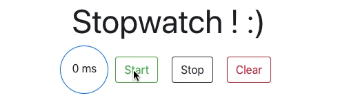

This app is a **stopwatch** built using **React** ⌚️✨

It displays the time elapsed in miliseconds after the **start** button is pressed 🔥🔥



In the project directory, the following command runs the app:

```bash
npm start
```


Then open http://localhost:3000/ to see the app.

